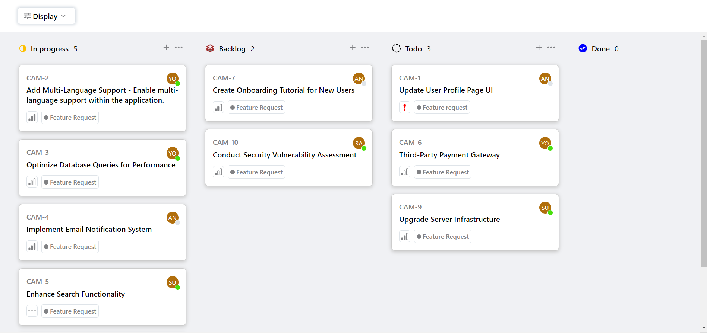
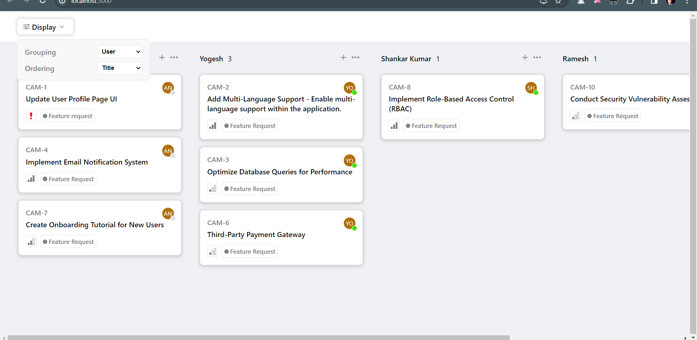
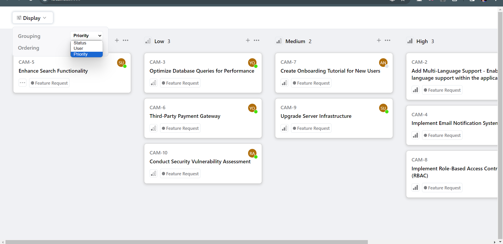

<h1 align="center">QuickSell Frontend Assignment</h1>

# Kanban-Board-React-App
It is a basic kanban board application that dynamically adjust to reflect the user's choice when a user clicks the "display" button and selects a grouping option.
https://quicksell.notion.site/Frontend-assignment-fa2f7f8aaada4099916994bad6ec70c2

## Features
1. Cards: It should be possible for users to make changes to the title, description, or any other pertinent information on the cards.
2. Filtering and Searching: Make it possible to look for and filter particular cards using parameters such as priority, title, or due date.
3. Collaboration and Comments: Include a comment system that enable users to exchange updates, talk about progress, and work together on tasks.
4. API Integration: To retrieve and change data dynamically, connect your application to the given API.
5. Responsiveness : This Kanban board is responsive and functions well across a range of platforms, such as PCs, tablets, and smartphones, by using responsive design.

## Objectives :
- The goal is to use ReactJs to construct an interactive kanban board application that offers three different methods to arrange data:
  1. By Status
  2. By user
  3. By Priority

- It ought to have two methods for sorting the tickets:
1. Priority
2. Title

- It should be responsive and visually appealing.
- To save the user's view state even after page reload. 

 ### Screenshots Of Web App
 <pre>
   
</pre>

  
## Installation

Here is a step by step guide to set this project up on your local environment!

**1. Clone the Repository**

Open a terminal or command prompt and navigate to the directory where you want to clone the repository. 

Run the following command

Using HTTPS

    $ https://github.com/AmanGuptaCoder/quicksell-assigment.git

**2. Navigate to the Project Directory**

Change your working directory to the project folder. 

Run the following command

    $ cd quicksell-assigment

**3. Install Dependencies**

Inside the project folder, install the required dependencies using npm. 

Run the following command

    $ npm install

**4. Run the Development Server**

Start the development server to run the React application locally. 

Run the following command

    $ npm start
